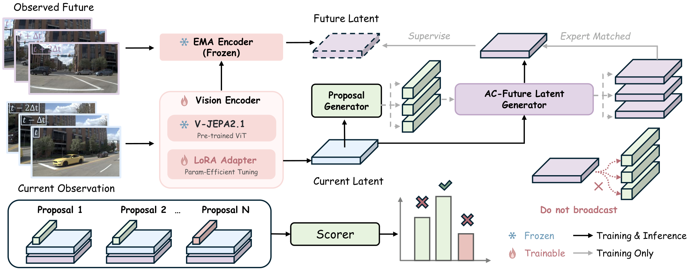
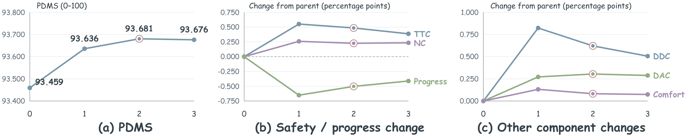
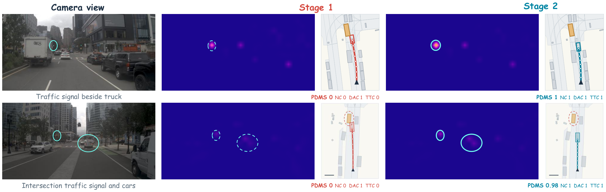
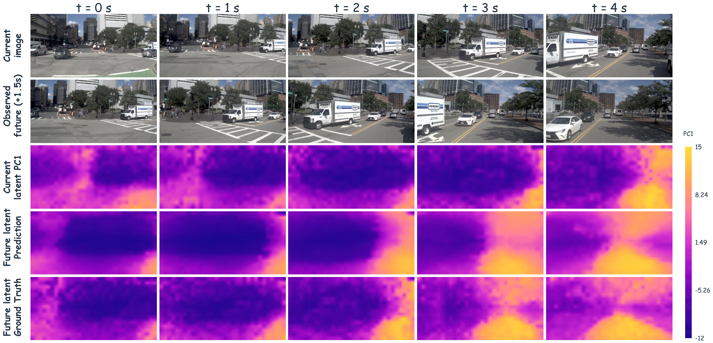

<div align="center">

# DA-WAM: Decision-Aligned Future Latents for Driving World Models

**Ruiguo Zhong · Benshan Ma · Xiaolong Chen · Lang Zhang**  
**Mingyue Feng · Yaonong Wang · Pei Liu · Jun Ma**

[**Paper**](https://arxiv.org/abs/2608.19085) · [**Overview**](#overview) · [**Results**](#results) · [**Visualization**](#visualization) · [**Getting Started**](#getting-started) · [**Citation**](#citation)

</div>

## Overview

**DA-WAM** connects future representation learning to trajectory selection. It first generates trajectory proposals, predicts a distinct future latent for each proposal, and scores each trajectory together with its associated future and the current scene.

- **Candidate-conditioned futures.** Each proposal receives its own compact action-conditioned representation.
- **Expert-matched supervision.** A training-only dense decoder and an EMA target supervise the candidate closest to the expert trajectory.
- **Safety-focused refinement.** Counterfactual trajectories refine the candidate-future path and scorer while keeping proposal generation fixed.

<p align="center">
  
</p>
<p align="center"><em>DA-WAM architecture. Shared scene tokens support candidate-specific prediction and scoring; dense future supervision is applied to the expert-matched candidate during training.</em></p>


## Results

### Retained models

| Benchmark | Model / inference setting | Metric | Result |
|---|---|---|---:|
| NAVSIM v1 | SafetyFinal epoch 1; learned candidate scores | PDMS ↑ | **93.6806** | 
| NAVSIM v2.2 | Same v1-trained model; temporal reranking | EPDMS ↑ | **89.2193** |
| Bench2Drive | Four-camera checkpoint, epoch 11 | Driving Score ↑ | **59.04** |

NAVSIM v2 uses training-free `momentum` reranking: `0.875 × learned_score + 0.125 × pair_EC`. NAVSIM v1 PDMS and v2 EPDMS follow different protocols and should not be compared directly.

The tables and figures below are taken from the supplied **September 2026 manuscript**. Selected baseline rows preserve that manuscript's values and rounding; they are not a continuously updated leaderboard. The linked arXiv v2 is an earlier version of the manuscript.

### NAVSIM v1

Selected rows from the paper's NAVSIM-v1 comparison. All metrics are higher-is-better, on a 0–100 scale.

| Method | NC | DAC | TTC | Comfort | EP | PDMS |
|---|---:|---:|---:|---:|---:|---:|
| PDM-Closed | 94.6 | 99.8 | 89.9 | 86.9 | 99.9 | 89.1 |
| Human driver | 100.0 | 100.0 | 100.0 | 99.9 | 87.5 | 94.8 |
| DriveVLA-W0 | 98.7 | 99.1 | 95.3 | 99.3 | 83.3 | 90.2 |
| ReCogDrive | 97.9 | 97.3 | 94.9 | 100.0 | 87.3 | 90.8 |
| iPad | 98.6 | 98.3 | 94.9 | 100.0 | 88.0 | 91.7 |
| SparseDriveV2 | 98.5 | 98.4 | 95.0 | 99.9 | 88.6 | 92.0 |
| DrivoR | 98.9 | 98.3 | 96.2 | 100.0 | 89.1 | 93.1 |
| DriveSuprim | 98.6 | 98.6 | 95.5 | 100.0 | 91.3 | 93.5 |
| **DA-WAM** | **99.1** | **98.9** | **96.8** | **99.8** | **90.0** | **93.7** |

### NAVSIM v2

Selected rows from the paper's NAVSIM-v2 comparison. All metrics are higher-is-better, on a 0–100 scale.

| Method | Backbone | NC | DAC | DDC | TLC | EP | TTC | LK | HC | EC | EPDMS |
|---|---|---:|---:|---:|---:|---:|---:|---:|---:|---:|---:|
| TransFuser | ResNet-34 | 96.9 | 89.9 | 97.8 | 99.7 | 87.1 | 95.4 | 92.7 | 98.3 | 87.2 | 76.7 |
| Hydra-MDP++ | ViT-L | 98.4 | 98.0 | 99.4 | 99.8 | 87.5 | 97.7 | 95.3 | 98.3 | 77.4 | 85.1 |
| DriveSuprim | ViT-L | 97.8 | 97.9 | 99.5 | 99.9 | 90.6 | 97.1 | 96.6 | 98.3 | 77.9 | 86.0 |
| SparseDriveV2 | ResNet-34 | 98.1 | 98.1 | 99.6 | 99.8 | 91.1 | 97.3 | 96.9 | 98.2 | 78.4 | 86.7 |
| DiffusionDriveV2 | ResNet-34 | 97.7 | 96.6 | 99.2 | 99.8 | 88.9 | 97.2 | 96.0 | 97.8 | 91.0 | 87.5 |
| **DA-WAM** | **ViT-L** | **99.2** | **98.8** | **97.8** | **99.5** | **91.1** | **98.7** | **93.3** | **96.7** | **77.1** | **89.2** |

<details>
<summary>Metric abbreviations</summary>

NC: No-at-Fault Collision; DAC: Drivable Area Compliance; TTC: Time to Collision; EP: Ego Progress; DDC: Driving Direction Compliance; TLC: Traffic Light Compliance; LK: Lane Keeping; HC: History Comfort; EC: Extended Comfort. PDMS and EPDMS are the respective aggregate benchmark scores.

</details>

### Bench2Drive

Selected rows from the paper's closed-loop comparison. “—” denotes values not reported in the supplied table.

| Method | Avg. L2 (m) ↓ | Efficiency ↑ | Comfortness ↑ | Success Rate (%) ↑ | Driving Score ↑ |
|---|---:|---:|---:|---:|---:|
| TCP-traj w/o distillation | 1.96 | 78.78 | 22.96 | 20.45 | 49.30 |
| UniAD-Base | 0.73 | 129.21 | 43.58 | 16.36 | 45.81 |
| VAD | 0.91 | 157.94 | 46.01 | 15.00 | 42.35 |
| EgoFSD-S | 0.70 | 178.30 | — | 21.00 | 52.02 |
| BridgeAD | 0.71 | — | — | 22.73 | 50.06 |
| SeerDrive | 0.66 | — | — | 30.17 | 58.32 |
| **DA-WAM†** | **0.95** | **140.40** | **14.64** | **24.66** | **59.04** |


### Ablation: future conditioning and safety supervision

| Configuration | Stage 2 safety supervision | PDMS ↑ | NC ↑ | DAC ↑ | EP ↑ | TTC ↑ | Comfort ↑ |
|---|:---:|---:|---:|---:|---:|---:|---:|
| No future prediction | No | 93.31 | 98.45 | 98.27 | 91.36 | 95.48 | 99.99 |
| Shared global future | No | 92.81 | 99.02 | 98.46 | 88.68 | 96.54 | 99.99 |
| Current-latent conditioning | No | 93.25 | 98.44 | 98.19 | 91.38 | 95.49 | 99.94 |
| Action-conditioned future | No | 93.46 | 98.88 | 98.58 | 90.47 | 96.33 | 99.69 |
| **Action-conditioned future** | **Yes** | **93.68** | **99.11** | **98.88** | **89.97** | **96.81** | **99.77** |

<p align="center">
  
</p>

Safety-focused refinement improves candidate ranking with a small progress trade-off. In this figure, **epoch 0 is Stage 1**, and epochs 1–3 count completed refinement epochs. The retained model after two completed refinement epochs is saved as **checkpoint epoch 1** under zero-based numbering.

## Visualization

### Safety-focused trajectory selection

<p align="center">
  
</p>

The paper's examples compare attention responses and selected trajectories before and after refinement. Image-space attention is a diagnostic visualization, not BEV localization or proof of causal influence.

### Future-feature prediction

<p align="center">
  
</p>

This figure uses a **separately trained 1.5-second visualization checkpoint**. The retained quantitative NAVSIM model uses a **0.5-second future target**; the visualization checkpoint is not included in the minimal release. Each column is an independent prediction. Feature colors denote a shared PC1 projection, not object identities or semantic classes.

## Getting Started

### Installation

See [environment setup](environment/README.md). Model training/inference uses Python 3.9; the CARLA client uses a separate Python 3.8 environment. OpenScene data, maps, metric caches, Bench2Drive training caches, and CARLA 0.9.15 remain external prerequisites.

```bash
cd /dahuafs/userdata/2639639/Code/leap-auto-wam
source environment/activate_model.sh
```

### Training

```bash
# NAVSIM Stage 1: Joint30
bash scripts/train_navsim.sh stage1

# NAVSIM Stage 2: SafetyFinal; supply the Stage 1 parent checkpoint
CHECKPOINT_PATH=/path/to/stage1_epoch15.ckpt bash scripts/train_navsim.sh stage2

# Bench2Drive: retained four-camera implementation
bash scripts/train_bench2drive.sh
```

The NAVSIM recipe uses 32 proposals and LoRA rank 32. Stage 2 starts from Joint30 epoch 15, freezes proposal generation, and retains SafetyFinal epoch 1. The Stage 1 parent is not bundled with the final-only checkpoints. The NAVSIM v2 result uses the v1-trained model without v2-specific training. Training launchers default to multiple GPUs and require prepared caches.

### Inference and evaluation

```bash
# Configuration checks only
bash scripts/eval_navsim_v1.sh --cfg job
bash scripts/eval_navsim_v2.sh --cfg job
python scripts/prepare_bench2drive_eval.py --check

# Evaluation: each output directory must be new
OUTPUT_DIR=/path/to/new/v1_result bash scripts/eval_navsim_v1.sh
OUTPUT_DIR=/path/to/new/v2_result bash scripts/eval_navsim_v2.sh
python scripts/prepare_bench2drive_eval.py --output /path/to/new/b2d_result
bash /path/to/new/b2d_result/run.sh
```

Override NAVSIM paths with `CHECKPOINT_PATH`, `MODEL_ENV`, `METRIC_CACHE_PATH`, `OPENSCENE_DATA_ROOT`, and `NAVSIM_EXP_ROOT`. Use `B2D_EVAL_ENV` and `CARLA_ROOT` for the CARLA environment. Configuration/import checks do not establish successful full benchmark reproduction.

### Checkpoints

Download the final NAVSIM and Bench2Drive checkpoints and required V-JEPA 2.1 backbone from the [Hugging Face model repository](https://huggingface.co/Ruiguo1/DA-WAM). Verify the files against `checkpoints/final_sha256.json`.
<!-- | File | Purpose |
|---|---|
| `checkpoints/navsim_final.ckpt` | SafetyFinal epoch 1; shared by NAVSIM v1 and v2 |
| `checkpoints/bench2drive_4cam_score11.ckpt` | Final Bench2Drive four-camera epoch 11 |
| `checkpoints/vjepa2_1_vitl.pt` | Required V-JEPA 2.1 pretrained backbone |

These files are retained **locally**; this README does not provide a public checkpoint download. See the [weight manifest](checkpoints/manifest.json) and [SHA256 checksums](checkpoints/final_sha256.json). -->

<details>
<summary><strong>Repository layout</strong></summary>

```text
navsim_v1/       Joint30 / SafetyFinal training and NAVSIM v1 inference
navsim_v2/       Official NAVSIM v2.2 inference and temporal reranking
bench2drive/    Four-camera training, inference and required shared modules
checkpoints/    Final models and required pretrained backbone only
third_party/    V-JEPA runtime dependencies
scripts/        Unified training and inference entrypoints
environment/    Installation and environment configuration
assets/         Paper figures used in this README
```

Only core training/inference code, required dependencies, final weights and README figures are retained here. Historical experiments, raw result archives and editable paper materials remain outside this directory in the sibling backup.

</details>

## Citation

```bibtex
@article{zhong2026dawam,
  title={DA-WAM: Decision-Aligned Future Latents for Driving World Models},
  author={Zhong, Ruiguo and Ma, Benshan and Chen, Xiaolong and Zhang, Lang
          and Feng, Mingyue and Wang, Yaonong and Liu, Pei and Ma, Jun},
  journal={arXiv preprint arXiv:2608.19085},
  year={2026},
  eprint={2608.19085},
  archivePrefix={arXiv},
  primaryClass={cs.RO},
  url={https://arxiv.org/abs/2608.19085}
}
```

## Acknowledgements

We thank the authors and maintainers of the open-source codebases that informed this work: [Drive-JEPA](https://github.com/linhanwang/Drive-JEPA), [SparseDriveV2](https://github.com/swc-17/SparseDriveV2), [DiffusionDrive](https://github.com/hustvl/DiffusionDrive), [WA-JEPA](https://github.com/AFARI-Research/WA-JEPA), and [iPad](https://github.com/Kguo-cs/iPad). We also build on [V-JEPA 2](https://github.com/facebookresearch/vjepa2) and use the [NAVSIM](https://github.com/autonomousvision/navsim), [nuPlan](https://github.com/motional/nuplan-devkit), and [Bench2Drive](https://github.com/Thinklab-SJTU/Bench2Drive) benchmarks and tools. 

## License

See [LICENSE](LICENSE). Bundled third-party components, datasets and pretrained weights remain subject to their respective licenses.
